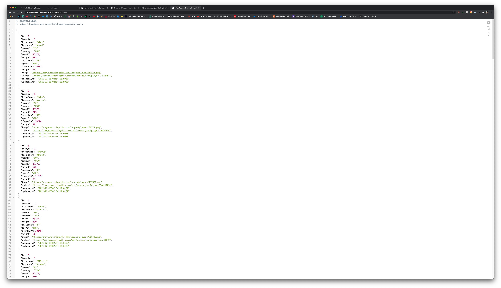

# Baseball-API

The Baseball-API is an API that is built with Rails that serves baseball data and stats. The data used is a compilation of various resources.

## Getting Started

These instructions will get you a copy of the project up and running on your local machine for development and testing purposes.

### Installation

The following steps will setup a Rails server for this application.

1. Clone this project
2. Navigate to directory and from the terminal, run

   ```shell
   bundle install
   ```

3. (optional) If you get a different version used form assign error, run

   ```shell
   rvm use 3.0.0
   ```

   and repeat step 2.

4. After gem installation is complete, run

   ```shell
   rails db:create && rails db:migrate && rails db:seed
   ```

5. Run the below command to run the server

   ```shell
   rails server
   ```

6. Check to see if it is working by opening **[localhost:3000](http://localhost:3000/)** in your browser.

## Project Checklist

[Checklist available here](https://github.com/rukshanuddin/baseball-api/blob/master/CHECKLIST.md)

## Deployment

The project is deployed on Heroku, [visit the players index route here.](https://baseball-api-rails.herokuapp.com/api/players)

## Screenshot



## Built With

- [Ruby](https://www.ruby-lang.org/en/) - Programming language
- [Rails](https://rubyonrails.org/) - Ruby server-side web application framework

## Contributing

Issues and pull requests are welcome at [https://github.com/rukshanuddin/baseball-api](https://github.com/rukshanuddin/baseball-api). This project as well as all other content on my GitHub are intended to be safe, welcoming, and open for collaboration.

Users are expected to adhere to the [Contributor Covenant code of conduct](https://www.contributor-covenant.org/version/1/4/code-of-conduct)

## Authors

- **Rukshan Uddin** - _Initial work_ - [GitHub/rukshanuddin](https://github.com/rukshanuddin) - [Personal Site](https://awesomeweb.design)

## Acknowledgments

I relied heavily on data from [Are You Watching This?!](https://areyouwatchingthis.com/api/?baseballhackday) and [FanGraphs](http://fangraphs.com/), check them out!

## License

This project is licensed under the MIT License - see the [LICENSE](LICENSE) file for details.
